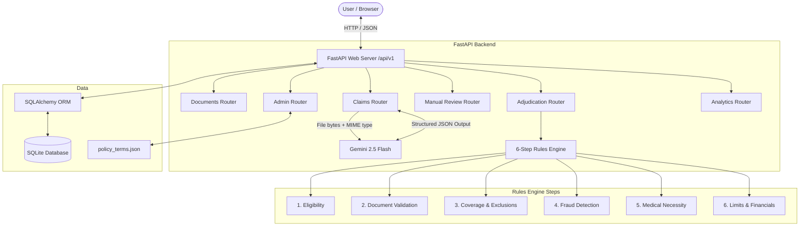
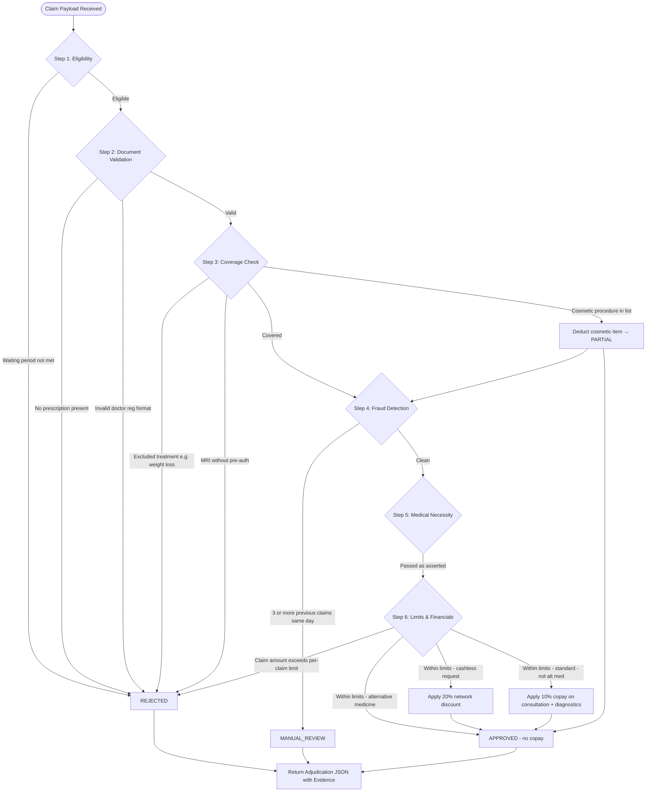

# ClaimPilot AI — Final Submission & Technical Documentation

**Candidate Name:** [Your Name Here]
**Date:** June 5, 2026

---

## Deliverable Links

### 1. GitHub Repository
https://github.com/hemanth-sai-2203/claimagent-ai


### 2. Deployed Application
**Frontend:** https://claimagent-ai-frontend.vercel.app/
**Backend API:** https://claimagent-ai.onrender.com


### 3. Project Source Code (Google Drive)
https://drive.google.com/drive/folders/1S9HYYGdCu4tB1i4ARjAX4POdfjcg27lU?usp=sharing


### 4. Demo Video (drive link)
https://drive.google.com/drive/folders/1Ym6RPt53WBTcjxmfcHvLbZ3o5TFeL_Bd?usp=sharing

---

## Project Overview

ClaimPilot AI is a full-stack, AI-assisted OPD (Outpatient Department) claim adjudication system built to automate insurance claim processing. The core problem it solves is this: claims teams currently have to manually cross-check uploaded medical documents against policy terms, apply financial limits, detect fraud, and decide whether to approve or reject — a slow, error-prone process.

ClaimPilot AI automates this by combining two distinct components:

1. **AI Extraction Layer**: Google Gemini 2.5 Flash reads the uploaded medical document (PDF or image) and extracts structured fields — doctor name, registration number, diagnosis, prescribed medicines, test names, and itemised bill amounts — into a validated Pydantic schema.
2. **Deterministic Rules Engine**: The extracted data is passed through a 6-step policy evaluation pipeline. Every step produces traceable evidence, and the final decision — `APPROVED`, `PARTIAL`, `REJECTED`, or `MANUAL_REVIEW` — is always made by the rules engine, never by the AI. This keeps decisions explainable and auditable.

Every claim produces a full audit trail showing which rule passed or failed and why, along with a confidence score, actionable next steps for the claimant, and a downloadable decision letter.

---

## Technology Stack

| Layer | Technology | Notes |
|---|---|---|
| Backend | FastAPI (Python 3.12) | REST API server, 6 routers under `/api/v1` |
| Database | SQLite + SQLAlchemy + Alembic | Claim persistence, audit logs, manual review queue |
| AI / Extraction | Google Gemini 2.5 Flash | Multimodal structured JSON output, `temperature=0` |
| Frontend | Next.js 15 (App Router) + TypeScript | Role-aware UI (User / Officer roles) |
| Styling | Tailwind CSS | |
| Deployment | Vercel (Frontend) + Railway (Backend) | |

---

## System Architecture

ClaimPilot AI follows a client-server architecture. The Next.js frontend communicates with the FastAPI backend through REST APIs. Inside the backend, six routers handle separate concerns: document upload, AI extraction, adjudication, manual review, admin policy management, and analytics.

The AI and the rules engine are intentionally kept separate. Gemini only extracts data from the document — it never makes a claim decision. All approve/reject logic lives in the deterministic Python rules engine.



---

## API Documentation

All endpoints are served under the `/api/v1` prefix. A health check is also available at the root.

### Health Check

#### `GET /health`

Returns the service status. Used to verify the backend is running.

**Response**
```json
{
  "status": "ok",
  "service": "ClaimPilot AI Backend"
}
```

---

### 1. Document Processing

#### `POST /api/v1/documents/upload`

Uploads a medical document file. Accepts images (JPEG, PNG) and PDFs. Saves the file to the local `uploads/` directory, creates a `Document` record in the database, and returns a `document_id` for use in subsequent extraction and adjudication calls.

**Request (Multipart Form Data)**
- `file` — JPEG, PNG, or PDF

**Response**
```json
{
  "document_id": "a1b2c3d4-e5f6-..."
}
```

---

### 2. Claims — AI Extraction

#### `POST /api/v1/claims/extract`

Reads the saved file for a given `document_id`, sends the raw bytes to Gemini 2.5 Flash with a structured extraction prompt, and returns validated extracted data. The `Document` record in the database is updated with the document type and extraction confidence. Temperature is set to `0.0` for deterministic output.

**Request (JSON)**
```json
{
  "document_id": "a1b2c3d4-e5f6-..."
}
```

**Response (JSON)**
```json
{
  "classification": {
    "document_type": "PRESCRIPTION",
    "confidence": 0.97
  },
  "extracted_data": {
    "prescription": {
      "doctor_name": "Dr. Rajan Sharma",
      "doctor_reg": "KA/45678/2015",
      "diagnosis": "Viral Fever",
      "medicines_prescribed": ["Paracetamol 650mg"],
      "procedures": [],
      "tests_prescribed": ["CBC"],
      "treatment": null
    },
    "bill": {
      "consultation_fee": 1000.0,
      "medicines": 350.0,
      "diagnostic_tests": 0.0,
      "test_names": []
    }
  },
  "overall_confidence": 0.95,
  "error_flags": []
}
```

`document_type` is one of: `PRESCRIPTION`, `MEDICAL_BILL`, `DIAGNOSTIC_REPORT`, `PHARMACY_BILL`, `OTHER`.
`error_flags` lists any physical document anomalies detected (e.g. blurry text, missing registration number, cropped margins).

---

### 3. Claims — Adjudication

#### `POST /api/v1/adjudication/`

The core endpoint. Accepts a full claim payload (member details + extracted document data), runs it through the 6-step deterministic rules engine, persists the result to the database, and returns the adjudication decision.

If `previous_claims_same_day` is not explicitly provided (sent as `0`), the engine queries the database to count how many prior claims exist for the same `member_id` on the same `treatment_date`.

If the decision is `MANUAL_REVIEW`, a `ManualReview` record is automatically created with status `PENDING`.

**Request (JSON)**
```json
{
  "document_id": "a1b2c3d4-...",
  "claim_data": {
    "claim_id": "CLM-2024-001",
    "member_id": "EMP001",
    "member_name": "Rahul Sharma",
    "member_join_date": "2024-01-01",
    "treatment_date": "2024-11-01",
    "claim_amount": 1500.0,
    "hospital": "City Clinic",
    "cashless_request": false,
    "previous_claims_same_day": 0,
    "documents": {
      "prescription": { "...extracted prescription fields..." },
      "bill": { "...extracted bill fields..." }
    }
  }
}
```

**Response (JSON)**
```json
{
  "claim_id": "CLM-2024-001",
  "decision": "APPROVED",
  "approved_amount": 1350.0,
  "deductions": { "copay": 150.0 },
  "network_discount": null,
  "cashless_approved": null,
  "confidence_score": 0.95,
  "fraud_score": 0.0,
  "rejection_reasons": [],
  "rejected_items": [],
  "flags": [],
  "notes": "Your claim has been approved. Reimbursement will be processed within 5-7 business days.",
  "next_steps": "...",
  "evidence": [
    { "rule": "Policy Active", "status": "passed", "details": "Policy is active on treatment date" },
    { "rule": "Member Covered", "status": "passed", "details": "Member Rahul Sharma is covered" },
    { "rule": "Waiting Period", "status": "passed", "details": "All applicable waiting periods completed" },
    { "rule": "Document Completeness", "status": "passed", "details": "All required documents are present" },
    { "rule": "Doctor Registration", "status": "passed", "details": "Doctor registration number is valid" },
    { "rule": "Coverage Check", "status": "passed", "details": "Services are covered under policy" },
    { "rule": "Fraud Check", "status": "passed", "details": "No obvious fraud indicators detected" },
    { "rule": "Medical Necessity", "status": "passed", "details": "Treatment aligns with stated diagnosis" },
    { "rule": "Per Claim Limit", "status": "passed", "details": "Claim amount is within limits" }
  ]
}
```

`decision` is one of: `APPROVED`, `PARTIAL`, `REJECTED`, `MANUAL_REVIEW`.

---

### 4. Claims — History & Detail

#### `GET /api/v1/claims/`

Returns a summary list of all claims stored in the database, sorted by insertion order.

**Response (Array)**
```json
[
  {
    "claim_id": "CLM-2024-001",
    "member_id": "EMP001",
    "member_name": "Rahul Sharma",
    "treatment_date": "2024-11-01",
    "claim_amount": 1500.0,
    "approved_amount": 1350.0,
    "decision": "APPROVED"
  }
]
```

#### `GET /api/v1/claims/{claim_id}`

Returns the full detail for a single claim, including the complete adjudication result JSON, linked document metadata, and full chronological audit log.

**Response (JSON)**
```json
{
  "claim_id": "CLM-2024-001",
  "member_id": "EMP001",
  "member_name": "Rahul Sharma",
  "treatment_date": "2024-11-01",
  "hospital": "City Clinic",
  "claim_amount": 1500.0,
  "decision": "APPROVED",
  "result": { "...full adjudication result..." },
  "documents": [
    {
      "document_id": "a1b2c3d4-...",
      "document_type": "PRESCRIPTION",
      "classification_confidence": 0.95
    }
  ],
  "audit_logs": [
    { "id": "...", "action": "CLAIM_SUBMITTED", "created_at": "2024-11-01T10:00:00" },
    { "id": "...", "action": "ADJUDICATION_COMPLETED", "created_at": "2024-11-01T10:00:01" }
  ]
}
```

---

### 5. Manual Review

#### `GET /api/v1/manual-review/`

Returns all claims that are in the manual review queue (both pending and resolved), with fraud flags and review status.

#### `POST /api/v1/manual-review/{claim_id}`

Allows a claims officer to submit a final decision on a claim in the manual review queue. The `ManualReview` record is marked `RESOLVED`, the `Claim` decision is updated, and an audit log entry `MANUAL_REVIEW_COMPLETED` is written.

**Request (JSON)**
```json
{
  "decision": "APPROVED",
  "notes": "Reviewed all documents. Approved manually."
}
```

`decision` must be either `APPROVED` or `REJECTED`. Returns `400` if the review is already resolved.

#### `POST /api/v1/manual-review/appeal/{claim_id}`

Allows a member to appeal any existing claim decision. The claim's decision is reset to `MANUAL_REVIEW`, a `ManualReview` queue record is created (or re-opened if it already existed), and an audit log entry `CLAIM_APPEALED` is written.

---

### 6. Admin — Policy Management

#### `GET /api/v1/admin/policy`

Returns the full in-memory `POLICY` dictionary, which is loaded from `policy_terms.json` at application startup.

#### `PUT /api/v1/admin/policy`

Accepts a complete replacement JSON body and writes it to `policy_terms.json`. After saving, it calls `reload_policy()`, which updates the in-memory `POLICY` dictionary in-place so that all running engine modules immediately see the new values without a server restart.

---

### 7. Analytics

#### `GET /api/v1/analytics/metrics`

Aggregates all claims in the database and returns summary metrics for the analytics dashboard.

**Response (JSON)**
```json
{
  "total_claims": 14,
  "decisions": {
    "APPROVED": 5,
    "REJECTED": 7,
    "PARTIAL": 1,
    "MANUAL_REVIEW": 1
  },
  "avg_confidence": 0.923,
  "fraud_flags": [
    { "reason": "Multiple claims same day", "count": 1 },
    { "reason": "Unusual pattern detected", "count": 1 }
  ]
}
```

`fraud_flags` is sorted by frequency descending.

---

## Decision Logic Flowchart

When a claim payload is submitted to `/api/v1/adjudication/`, the engine runs through 6 sequential steps. Fraud detection takes priority — if fraud flags are detected, the claim is routed to `MANUAL_REVIEW` before any financial calculations occur. Hard policy violations result in `REJECTED`. Only if all checks pass does the engine proceed to financial limit calculation and produce an `APPROVED` or `PARTIAL` outcome.



---

## Assumptions Made

### 1. Doctor Registration Validation

Doctor registration numbers must follow the pattern `STATE_CODE/NUMBER/YEAR` (e.g. `KA/45678/2015`). For Ayurvedic practitioners, the engine also accepts formats like `AYUR/KL/2345/2019` using an extended regex: `[A-Z]{2,4}/?\\w*/\\d{3,6}/\\d{4}`. Numbers that do not match are flagged as `DOCTOR_REG_INVALID` and the claim is rejected.

### 2. Fraud Detection Threshold

A claim is flagged as `MANUAL_REVIEW` due to fraud if the member has **3 or more** previous claims on the exact same calendar day (`previous_claims_same_day >= 3`). This count is automatically looked up from the database when not explicitly provided in the request payload.

### 3. Financial Calculations

- A **10% co-payment** is applied to `consultation_fee` and `diagnostic_tests` line items for non-network, non-alternative-medicine claims.
- A **20% network discount** is applied to the total claim amount when `cashless_request` is `true`.
- Cosmetic procedures (e.g. teeth whitening) are deducted from the approved amount using the itemised `teeth_whitening` field in `BillData`. If the field is absent, no deduction is made.
- **Alternative medicine** (detected via `ayur` in the doctor registration number) is approved without a co-payment.
- **Dental claims** are evaluated against the dental `sub_limit` (₹10,000) rather than the general `per_claim_limit` (₹5,000) when the diagnosis contains the word "tooth".

### 4. Policy Loading and Hot-Reload

`policy_terms.json` is loaded once into a module-level `POLICY` dictionary at application startup. When the Admin endpoint writes an update, `reload_policy()` modifies this dictionary in-place using `.clear()` followed by `.update()`, ensuring all engine modules that have already imported `POLICY` see the changes immediately without a process restart.

### 5. Member Database

There is no live member/employee database. Member details such as `member_join_date` and `member_name` are supplied by the user directly on the claim submission form and passed through to the engine as-is. In a production system, these would be verified against a company HR database.

### 6. Medical Necessity

The medical necessity step (`validate_necessity`) currently always passes, asserting that "treatment aligns with stated diagnosis". In production, this step would map ICD-10 diagnosis codes to CPT procedure codes to verify clinical alignment.

### 7. File Storage

Uploaded files are saved to a local `uploads/` directory relative to the backend process. There is no external file storage (e.g. S3). This is suitable for the MVP and local/Railway deployments where the filesystem persists.

### 8. Roles

User roles (`user` and `officer`) are managed entirely on the frontend via `localStorage`. There is no backend authentication or JWT token verification. Officers see the Manual Review and Admin pages; regular users see only Upload, Claims, and their Claim Detail pages.

---

## Challenges Faced

### Keeping AI Separate from Decisions

The initial design risk was that a bad extraction — Gemini misreading a date or inventing a diagnosis — could directly cause a wrong claim decision. The resolution was to keep the AI and rules engine completely separate. Gemini's only job is to extract structured data from the document image. The final approve/reject decision is always made by the deterministic Python engine from that extracted data.

### Structured Output Schema Design

Getting Gemini to consistently return numerical values (not strings like `"₹1,000"`) for bill amounts required careful Pydantic schema design. By using `float` fields with `ge=0.0` constraints and setting `response_schema=ExtractionResult` in the `GenerateContentConfig`, the SDK enforces the schema at the API level before the response reaches the application.

### Policy Reload Without Restart

The `POLICY` dictionary is imported by multiple modules at startup. Simply re-reading the JSON file and reassigning `POLICY` in the admin endpoint would only update the local variable, not the references already held by the engine modules. The fix was to use `.clear()` + `.update()` on the original dictionary object, mutating it in-place so all imported references are automatically updated.

### Fraud Flag Data Type

Fraud flags in the database were stored as a list of plain strings (e.g. `["Multiple claims same day"]`). The analytics endpoint initially tried to call `.get("reason")` on each flag, treating them as dictionaries, which caused a `500 Internal Server Error`. The fix was to add an `isinstance(flag, str)` check that handles both string flags and potential future dict-based flag objects.

### Member ID Incrementing

The claim ID is generated with an auto-incrementing counter (`CLM-XXXX`) using the total count of existing claims in the database as the seed. The member ID is supplied directly by the user on the form and does not change between submissions.
