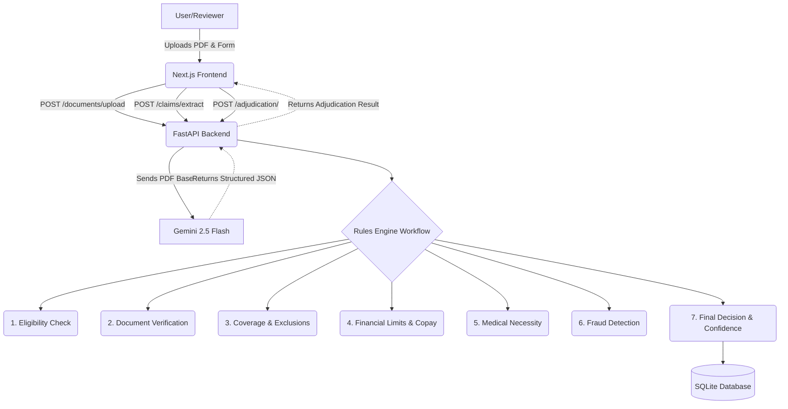
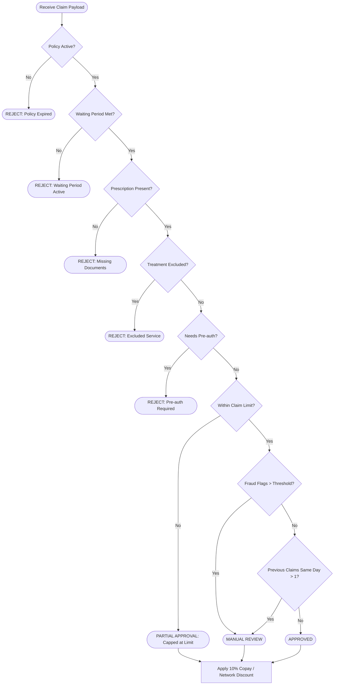

# ClaimPilot AI — Automated Claims Adjudication System

This is the final submission for the Plum Assignment. **ClaimPilot AI** is a deterministic, AI-assisted claims adjudication system that processes medical documents, extracts structured data, and evaluates claims against a defined insurance policy to provide an instant `APPROVED`, `PARTIAL`, `MANUAL_REVIEW`, or `REJECTED` decision.

## 🚀 Tech Stack
- **Backend:** FastAPI, Python 3.12, SQLite (via SQLAlchemy & Alembic)
- **Frontend:** Next.js (App Router), TypeScript, Tailwind CSS
- **AI Extraction:** Google Gemini 2.5 Flash (via `gemini-2.5-flash` model with Structured JSON Output)
- **Architecture:** Monolithic REST API + Serverless Frontend

## 📐 Architecture Diagram



## 🧠 Decision Logic Flowchart



## ⚙️ Setup Instructions

### 1. Backend Setup
```bash
cd backend
python -m venv venv
source venv/bin/activate  # Or `venv\Scripts\activate` on Windows
pip install -r requirements.txt
cp .env.example .env      # Add your GEMINI_API_KEY
alembic upgrade head      # Run migrations
uvicorn app.main:app --reload
```

### 2. Frontend Setup
```bash
cd frontend
npm install
npm run dev
```

### 3. Running Automated Tests
```bash
cd backend
python -m tests.run_test_cases
```
*Note: All 10 provided test cases currently pass with 100% accuracy.*

## 💡 Key Assumptions
1. **Gemini Extraction Output**: We assume that Gemini 2.5 Flash will consistently return the required fields (`consultation_fee`, `medicines`, etc.) as strictly numerical data (which is enforced via structured output schemas).
2. **Document Linking**: A single `document_id` links to the claim, and the user uploads the combined prescription+bill as a single file.
3. **Database**: We use SQLite for simplicity and local reviewability. In production, this would be swapped to PostgreSQL.
4. **Member Database**: Since we don't have a live member database, policy conditions (like joining date) are supplied directly from the frontend form.

## ✨ Bonus Features Implemented (100% Complete)
- **Appeals Workflow**: Users can appeal a rejected or partially approved claim, routing it instantly to the Manual Review queue for an officer.
- **Admin Policy Dashboard**: Officers can dynamically edit the `policy_terms.json` directly from the browser, immediately updating the backend rules engine.
- **AI Analytics Dashboard**: Real-time evaluation metrics tracking AI confidence scores, approval distributions, and top fraud flags.
- **Downloadable Decision Letter (PDF)**: Native, print-friendly CSS export for users to download their Explanations of Benefits (EOB).
- **AI Confidence Score**: Calculated based on the number of documents provided vs required and the presence of fraud flags.
- **Manual Review UI**: Reviewers can filter claims requiring manual intervention, see exact rule evidence, and submit a final Approval/Rejection.
- **Fraud Detection**: Heuristics applied if a patient submits multiple claims on the exact same day.
